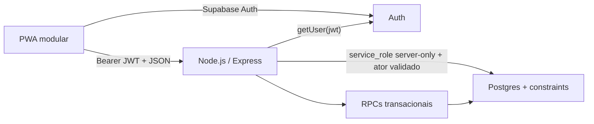

# KortexOS — MVP técnico greenfield

## 1. Objetivo

Construir uma fundação pequena, testável e implantável para um ERP vertical de beleza e bem-estar. Os SQL enviados anteriormente são exemplos e não fazem parte da arquitetura vigente.

## 2. Arquitetura



O frontend gerencia sessão e interface. O Express valida o JWT, resolve membership, calcula e orquestra. O Postgres garante integridade e atomicidade; FKs compostas e RPCs revalidam ator e tenant.

## 3. Decisões centrais

- Greenfield: nenhum compromisso de compatibilidade com migrations de exemplo.
- Multi-tenant desde o baseline por `organizations` + `memberships`.
- Supabase Auth como identidade; autorização por membership e role.
- Backend usa `service_role` exclusivamente no servidor após validar JWT e membership; funções recebem o ator validado e rechecagem no banco.
- `anon` e `authenticated` não recebem grants de tabelas nem RPCs de negócio.
- PWA usa Supabase apenas para Auth; todo domínio passa pela API.
- Um monólito modular Express e uma PWA são suficientes; não criar microserviços.

## 4. Domínios e tabelas

| Domínio | Tabelas |
|---|---|
| Identidade | `profiles`, `organizations`, `memberships` |
| CRM | `clients` |
| Operação | `professionals`, `services`, `service_groups`, `packages`, `package_items`, `appointments` |
| Estoque | `products`, `inventory_movements` |
| Venda | `orders`, `order_items`, `payments` |
| Financeiro mínimo | `cash_entries` |
| Infra transacional | `private.idempotency_keys` |

`service_groups`/`services.commission_type`/`services.commission_value` sustentam a cascata de comissão (profissional > serviço > grupo, ver `docs/PLANEJAMENTO_COMISSOES.md`); `packages`/`package_items` são pacotes compostos de serviços vendidos por um preço próprio. Ambos são consumidos por `checkout_close` desde a Fase 5.1 (`professional_service_commissions`, `order_items.professional_id`/`commission_*`, expansão de pacote com alocação proporcional) — ver `docs/PROJECT_STATE.md`.

Todas as referências de negócio importantes carregam `organization_id` e usam FKs compostas para impedir referências cross-tenant.

## 5. Fluxos verticais

### Onboarding

`signup → profile automático → create_organization → membership owner → configuração inicial`.

### Agenda

`cliente + profissional + serviço + intervalo → validação tenant → constraint de não sobreposição → agendamento`.

### Checkout

`intenção + idempotency key → autorização → catálogo server-side → lock de produtos → baixa de estoque → itens → pagamentos → caixa → resposta`.

O checkout usa uma única função transacional. Mesma chave com payload diferente falha; o frontend nunca envia preço confiável. Ajustes de estoque usam RPC própria, também idempotente, e toda alteração de saldo gera `inventory_movements`.

## 6. Estrutura de repositório

```text
backend/
  src/
    config/ middleware/ modules/ shared/
  tests/{unit,integration,contract}/
frontend/
  src/{app,modules,shared}/
  public/{manifest.json,icons/}
supabase/
  migrations/
  tests/
data/{schemas,fixtures,exports}/
docs/
.agents/skills/
.env.example
.gitignore
render.yaml
```

## 7. Contrato da API

- Prefixo `/api/v1`.
- `Authorization: Bearer <access_token>` obrigatório fora de health/auth callbacks.
- `X-Organization-Id` seleciona uma organização, mas o backend valida membership; o header sozinho nunca concede acesso.
- `Idempotency-Key` obrigatório em checkout e ajustes de estoque.
- Erros: `{ code, message, request_id, details? }`, sem stack/SQL/segredos.
- Valores monetários terminam em `_cents` e usam inteiro seguro/string no JSON.

## 8. Segurança Supabase

- RLS em toda tabela pública como defesa adicional, embora o caminho privilegiado do backend a ignore.
- Policies usam `TO authenticated`, `USING` e `WITH CHECK`.
- Helpers de membership ficam em schema `private`, fora da Data API.
- Funções `SECURITY DEFINER` verificam `auth.uid()`, membership e role; `PUBLIC`/`anon` são revogados no mesmo change set.
- Grants de `authenticated` são primeiro revogados e depois liberados por allowlist; tabelas financeiras não recebem DML direto.
- `stock_on_hand` não possui grant direto de update; apenas RPCs transacionais alteram saldo.
- Nenhuma autorização usa `user_metadata`; roles residem em memberships controladas.
- Grants e RLS são tratados como camadas separadas.

## 9. Entrega

Render hospeda API Node e PWA estática; Supabase permanece serviço externo. Usar `npm ci`, Node pinado, `dist/` allowlisted, `/health`, CORS exato e secrets `sync: false`. GitHub CI executa testes, lint, migration reset, advisors, secret scan e build.

## 10. Fases

1. Baseline Supabase, Auth, organizations/memberships e testes RLS.
2. Backend health, JWT middleware e contexto de organização.
3. CRM, profissionais, serviços e produtos.
4. Agenda com concorrência.
5. Checkout/estoque/pagamentos/caixa idempotente.
6. PWA modular, offline apenas para shell/rascunhos não críticos.
7. CI, Render, observabilidade e Red Team.

## 11. Não objetivos

Ledger contábil completo, fiscal, folha, marketplace, assinatura, IA, múltiplas unidades complexas, integrações de pagamento e analytics avançado ficam fora do MVP.
