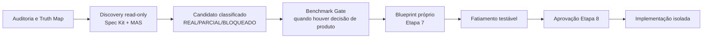

# Programa de Convergência 6.x

## Objetivo

Converter os achados da auditoria estratégica em uma sequência governável de decisões e entregas, sem diluir o contrato já fechado da Onda 6. O programa é uma camada de convergência: ele compara a verdade técnica, o produto desejado e a evidência de mercado para propor ondas ou incrementos independentes.

**Status:** discovery read-only autorizada por DEC-67. Este documento não é Blueprint, não é fatiamento executável e não autoriza mudança de código, migration, flag, ambiente ou promoção.

## Fronteira com a Onda 6

| Elemento | Situação | Regra |
|---|---|---|
| Onda 6 — checkout/reabertura | Fatiamento 055–061 validado; Etapa 8 local autorizada por DEC-66 | Escopo congelado em ADR 0025/Blueprint. Implementar uma fatia por vez; não absorver candidatos do programa. |
| Candidatos pós-auditoria | Discovery autorizado | Cada candidato recebe mapa de evidência, dependências, benchmark aplicável e proposta própria de Blueprint/fatiamento. |
| Código, migrations e promoção | Fora do discovery | Dependem de aprovação explícita de Blueprint e Etapa 8; promoção continua com Environment Guardian e Delivery Guardian. |

## Trilhas iniciais de investigação

Estas são hipóteses de investigação, não backlog autorizado. A classificação final só ocorre após confronto com código/testes, Truth Map e Benchmark Gate.

1. **Fechamento financeiro observável:** confirmar a integração operacional entre checkout, KortexFlow, comissão de venda, caixa e locks; separar o que a Onda 6 resolve do que exige escopo próprio.
2. **Capacidades entregues sem superfície operacional:** medir a lacuna PWA/Express das fundações de disponibilidade, recorrência, grupo e waitlist antes de propor UX, API ou ativação.
3. **Multiunidade e governança de tenant:** consolidar evidências de unidade, alçadas, feature flags e testes cross-tenant sem redesenhar invariantes já aprovadas.
4. **Inteligência, ocupação e canais externos:** ordenar somente depois das fundações e dos fluxos operacionais, incluindo dados confiáveis, conectores e qualquer PSP/runtime externo.

## Fluxo MAS + Spec Kit

O Spec Kit é usado para preflight, rastreabilidade de fontes, evals e context packs read-only. O fan-out aprovado continua limitado ao contrato de DEC-63; não há runner de escrita, fan-in automático de código ou autorização autônoma.

## Entregáveis do discovery

- Mapa de candidatos com evidência `REAL`, `PARCIAL`, `BLOQUEADO` ou `DESCONHECIDO`.
- Grafo de dependências e fronteiras explícitas com as Ondas 6 e 7.
- Para cada candidato priorizado: benchmark, hipótese de valor, métrica de sucesso, guardrail, riscos e recomendação de onda/incremento.
- Somente após decisão de produto: Blueprint e fatiamento vertical próprios, com gates documentados.

## Critérios de saída

O discovery termina quando cada candidato tiver uma de três saídas: (a) absorvido justificadamente por uma onda já autorizada, sem ampliar seu contrato; (b) convertido em proposta de Blueprint independente; ou (c) mantido em backlog com bloqueador verificável. Nenhuma saída equivale a autorização de implementação.

## DOCUMENTATION_CHECK

- [x] Artefato classificado em `docs/architecture/governance/` e com frontmatter válido.
- [x] `docs/INDEX.md` atualizado para expor estado e navegação.
- [x] DEC-67 registrado e incluído na matriz DEC↔ADR como decisão de processo, sem ADR técnico novo.
- [x] Links locais deste documento verificados na criação.
